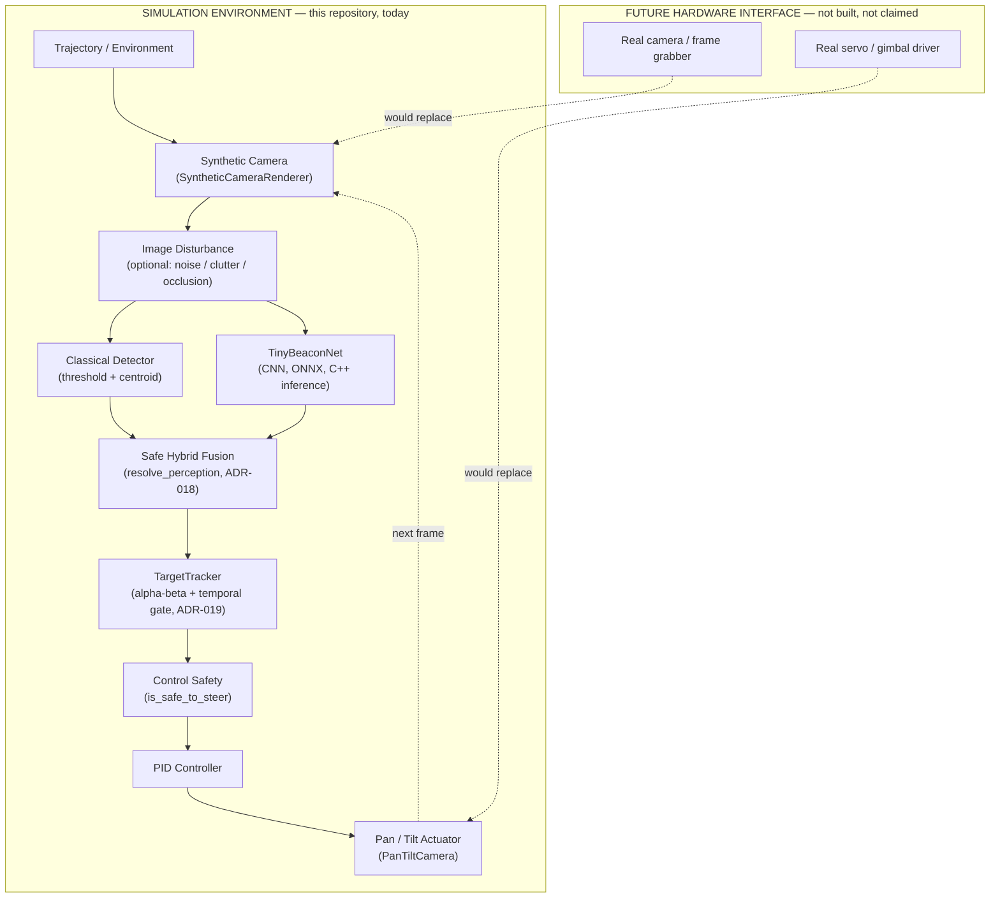

# FSOC

### Autonomous closed-loop coarse alignment for mobile Free-Space Optical Communication terminals

**Smart India Hackathon 2026 · SIH26169**

[](https://github.com/ThatKJ/FSOC/actions/workflows/ci.yml)


FSOC detects an optical beacon through a virtual pan/tilt camera, fuses classical and
neural (CNN) perception, estimates short-term target motion, and automatically commands
pan/tilt corrections to keep the beacon aligned — a full closed-loop guidance / tracking
/ control stack, implemented and measured end-to-end in a deterministic C++20
simulation.

## The problem

Free-Space Optical (FSO) communication links move data at high bandwidth over narrow,
highly directional laser beams — and that narrowness is the weakness: on a **mobile**
terminal (vehicle, vessel, aircraft), platform motion and vibration constantly knock the
beam off target. Before a fine-tracking stage can lock on, something has to keep the
remote terminal inside that fine-tracker's narrow capture range in the first place.
That's **coarse alignment** — SIH26169's problem statement — a real perception + control
problem, not a scripted vision demo.

## What FSOC does

```
SEE  →  ESTIMATE  →  PREDICT  →  CORRECT
```

- **SEE** — a synthetic pan/tilt camera observes a moving beacon; a classical
  threshold/centroid detector *and* a real trained CNN (`TinyBeaconNet`) each
  independently propose a centroid.
- **ESTIMATE** — a Safe Hybrid fusion policy combines them, rejecting disagreement
  outright rather than guessing which one is right.
- **PREDICT** — a minimal alpha-beta state estimator tracks position/velocity and
  bridges brief detection gaps instead of losing the target on every blink.
- **CORRECT** — a PID controller turns the fused, estimated position into pan/tilt rate
  commands, actuated by a saturating virtual gimbal.

Every stage above is real, tested C++20 code, not a scripted or pre-recorded demo.

## Architecture



No physical camera, beacon, or pan/tilt hardware exists anywhere in this repository
today — see **Hardware boundary** below. The interfaces above (`FrameSource` /
`Detector` / `Controller` / `PanTiltCamera`) are deliberately swappable
(`docs/09_FUTURE_ARCHITECTURE.md`) so that boundary can move later without touching the
detector, PID, or `SimulationRunner` step order.

## Measured results

Every number below comes from a committed, deterministic tool in this repository —
none is estimated or hand-picked. Full methodology and raw evidence:
`docs/MVP_METRICS.md`, `docs/MVP_ABLATION.md`, `docs/SIH_MVP_FREEZE.md`.

| | |
|---|---|
| Step-10 baseline acceptance | **7 / 7 PASS** |
| C++ test suites (`ctest`) | **17 / 17** (100%) |
| Frontend end-to-end tests (Playwright) | **20 / 20** |
| Severe (>50px) closed-loop outliers — Classical | 2,240 |
| Severe closed-loop outliers — Classical + Tracker | 12 (**↓ ~99.5%**) |
| Severe closed-loop outliers — Hybrid | 1,808 |
| Severe closed-loop outliers — Hybrid + Tracker (V2) | 9 (**↓ ~99.5%**) |
| Full-step latency, Hybrid + Tracker, P95 | **~1.2 ms**, vs. the 20 ms / 50 Hz budget |
| Telemetry pipeline | 42-column real CSV export, header-driven |

**On wording**, deliberately: this is a *"~99.5% reduction in severe (>50px) closed-loop
pointing outliers, measured in the deterministic simulation evaluation"* — not "99.5%
accuracy," and not a claim that clutter false-locking is solved in general. See **Known
limitations** below for exactly what this does and does not fix.

## Working demo

<p align="center">
  
</p>

*Real Step-9 visualizer output from the deterministic C++ simulation — not a mockup.*

Five self-contained, one-command, reproducible conditions (`docs/MVP_GOLDEN_DEMO.md` has
the full 15-step judge walkthrough with narration):

```bash
./build/debug/fsoc_demo normal          # calm baseline
./build/debug/fsoc_demo noise           # ordinary sensor noise, handled unaided
./build/debug/fsoc_demo clutter         # the false-lock problem, live, honestly framed
./build/debug/fsoc_demo occlusion       # short-gap prediction bridging
./build/debug/fsoc_demo reacquisition   # full Lost -> fresh-reacquire state-machine cycle
```

> **Demo Preview (manual capture pending)** — the images above are real, but a short
> screen capture of the live Mission Control session (ENGINE mode, `clutter` or
> `reacquisition` preset, the "STATE ESTIMATOR (P0-v2)" panel visible) would be the
> single highest-value visual to add here. To capture it: `cd frontend && npm run dev`,
> switch the source toggle to **ENGINE**, select a scenario, and record the browser tab
> (a 10-15s GIF or MP4 of the telemetry rail updating live is enough — no editing
> needed). Drop it at `frontend/public/demo/mission-control.gif` and reference it here.

## AI / Hybrid perception

Additive, post-`v1_baseline` work — the frozen classical baseline is **unchanged** by
any of this (`docs/19_AI_PERCEPTION_ARCHITECTURE.md`, `DECISIONS.md` ADR-015/016/017/018).

- **A real trained model, not a stub.** `TinyBeaconNet` (27,282 parameters, a small
  fully-convolutional heatmap network) is trained on a deterministic, seeded synthetic
  dataset, exported to ONNX, and loaded natively in C++ via OpenCV-DNN
  (`AiBeaconDetector`) — no Python in the runtime path. Python↔ONNX Runtime↔C++ numeric
  parity is measured: centroid agreement **1.54e-7 px** on this machine.
- **Safe Hybrid fusion (ADR-018), not a confidence blend.** `resolve_perception()`
  implements a frozen decision table: classical+AI agreement (≤8.0 px) accepts the
  classical centroid; classical-only accepts classical; **AI-only and any
  classical/AI disagreement both reject unconditionally** — no averaging, no "trust
  whichever is brighter."
- **Measured, unflattering-where-true evaluation.** The frozen Stage-4 protocol
  (`docs/21_AI_STAGE4_EVALUATION_PROTOCOL.md`) scores Classical vs. AI vs. Hybrid across
  11 deterministic degraded scenarios. Hybrid alone reduces severe closed-loop outliers
  ~20% vs. Classical, but does **not** fix Classical's clutter false-lock unaided — that
  required the state estimator below.
- Reachable from the real demo: `fsoc_demo <scenario> --mode classical|ai|hybrid`,
  with a loud fallback to Classical if the ONNX model can't load.

## State estimation + prediction

`fsoc::TargetTracker` — a minimal **alpha-beta (g-h)** state estimator with a temporal-
consistency gate, deliberately **not** a Kalman/UKF (`include/fsoc/target_tracker.hpp`).
Additive and default-off (`tracker_enabled = false` / `fsoc_demo --tracker`); every seam
is proven bit-identical to the pre-tracker behavior when disabled.

- **Root cause found and fixed, not guessed.** Classical's clutter vulnerability traced
  to a bad-acquisition mechanism: 3 consecutive detections confirmed a track even when
  they disagreed spatially. Fixed in the estimator's acquisition logic (`DECISIONS.md`
  ADR-019).
- **Measured mitigation**, full frozen Stage-4 protocol (22,000 frames/config): severe
  outliers fall from 2,240 (Classical) / 1,808 (Hybrid) to 12 / 9 — a **~99.5%
  reduction** — at a real, disclosed coverage cost (~20 points). The intrinsic 44.9%
  single-frame false-positive rate is unchanged (unfixable without touching the frozen
  classical detector algorithm).
- **A real, disclosed limit, not hidden**: a *temporally coherent* (smoothly moving)
  distractor defeats this mitigation completely (`docs/MVP_ABLATION.md §6`) — the gate
  rejects spatially/temporally *incoherent* candidates, not any adversarial one.
- **Full latency budget measured**: every configuration, including Hybrid+Tracker, fits
  inside the 20 ms / 50 Hz budget (~1.2 ms P95) on this development machine — not a
  hardware claim.
- Telemetry: the CSV export carries 42 columns total (27 core + 7 AI-perception + 8
  tracker, all additive and header-driven — old readers unaffected).

## Mission Control (frontend)

A Next.js UI that visualizes the real telemetry above — it never fakes data, which is
enforced by an automated Playwright guard that fails the build if any application
source contains `Math.random`.

```bash
cd frontend && npm install
npm run dev          # http://localhost:4317
```

- **ENGINE mode** runs the actual `fsoc_demo` C++ binary live and streams its real CSV
  output over `/api/simulation/:scenario`.
- **REPLAY mode** plays back a checked-in, deterministic recording of that same binary
  (useful when the C++ build isn't available locally).

Neither mode is a physical test bench — see **Hardware boundary**. The top bar labels
the session **"Simulation"** explicitly and reads "Sim Feed Active/Fault" (not
"Uplink") so it can never be misread as a live hardware/RF connection.

## Quick start

```bash
# --- one-time setup (macOS) ---
xcode-select --install      # only if Command Line Tools are missing
brew install cmake ninja opencv

# --- build + test the C++ engine ---
cmake --preset debug
cmake --build --preset debug
ctest --preset debug                     # 17/17 suites

# --- run the demo ---
./build/debug/fsoc_demo normal           # base scenarios: static|sinusoidal|loss|open|closed
./build/debug/fsoc_demo static --mode hybrid --tracker   # AI + Safe Hybrid + state estimator
./build/debug/fsoc_demo clutter          # named disturbance preset (see "Working demo")

# --- Mission Control frontend ---
cd frontend && npm install
npm run dev                              # http://localhost:4317
```

Steps that need OpenCV are auto-skipped with a one-line CMake notice if it isn't
installed — no Homebrew paths are hardcoded. Ubuntu/CI equivalents:
`sudo apt-get install -y ninja-build libopencv-dev` (see `.github/workflows/ci.yml`,
which runs this exact pipeline on every push/PR).

## Validation

Three independent layers, all reproducible locally:

```bash
ctest --preset debug                                                        # 17/17 C++ suites
./build/debug/step10_validation_smoke                                       # 7/7 baseline gates
cmake --preset release && cmake --build --preset release
./build/release/stage4_evaluation --out generated/ai_stage4                 # ~10-15 min, frozen protocol
./build/release/stage4_tracker_ablation --out generated/ai_stage4_ablation  # ~15 min, clutter mitigation
./build/release/mvp_dynamic_scenarios --out generated/mvp_dynamic_scenarios # velocity/dropout/moving-clutter
./build/release/mvp_latency_budget                                          # full latency budget, seconds
cd frontend && npm run typecheck && npm run lint && npm run build && npx playwright test
```

`docs/16_BASELINE_ACCEPTANCE.md`, `docs/21_AI_STAGE4_EVALUATION_PROTOCOL.md`,
`docs/MVP_ABLATION.md`, and `docs/SIH_MVP_FREEZE.md` are the canonical, frozen sources
for what each gate/protocol measures and why.

## Known limitations

State these proactively — they're disclosed in `docs/SIH_MVP_FREEZE.md`, not buried:

1. **A temporally coherent moving distractor defeats the clutter mitigation
   completely** — identical outlier counts with or without the tracker
   (`docs/MVP_ABLATION.md §6`). The single most important limitation.
2. **The intrinsic single-frame classical false-positive rate (44.9%) is unchanged** —
   unfixable without touching the frozen classical detector algorithm.
3. **AI-only reacquisition through `resolve_perception()` is not implemented** — the
   prerequisite gate exists (ADR-019); unlocking it is a distinct, deliberately
   deferred change to the frozen fusion policy.
4. AI recall is intentionally low (~16-40% depending on scenario) rather than
   over-confident — a deliberate precision-over-recall design choice, not a bug.
5. Real coverage cost: Hybrid+Tracker trades ~20 points of coverage for the outlier
   reduction above — a disclosed trade, not a free win.
6. Evaluated at n=5 seeds per scenario (matches the frozen protocol) — real, not
   large-sample, statistics.

## Hardware boundary

Zero physical camera, beacon, servo, or pan/tilt hardware has been used anywhere in
this project. Every number in this README comes from the deterministic C++ simulation
on a desktop-class development machine (Apple M5). **No claim of embedded, flight, or
real-time-on-target hardware performance is made or implied anywhere in this
repository.** See `docs/MVP_METRICS.md §5` and `docs/SIH_MVP_FREEZE.md §6`.

## Repository structure

```text
include/fsoc/       Public interfaces
src/                Core implementations
apps/               Executable simulation/demo/benchmark/evaluation programs
tests/              Mathematical/unit validation (CTest)
models/             Committed trained ONNX model + metadata (models/MODEL_CARD.md)
tools/ai/           Offline Python training toolchain (NOT part of the C++ runtime)
frontend/           Next.js Mission Control UI (reads real fsoc_demo telemetry)
cmake/              Build policies
.github/workflows/  CI (build + test, C++ and frontend)
.claude/skills/     Claude Code engineering skills
.claude/agents/     Specialist subagents
docs/               Design docs, measured metrics, ADRs, development history
prompts/            Reusable Vibe Coding prompts
generated/          Git-ignored run artifacts (CSV/PNG/JSON reports) — never committed
```

## Engineering history & deeper docs

- **Full documentation index**: `docs/README.md`
- **Chronological build log** (Step 1 → Step 11, exact numbers at each stage):
  `docs/DEVELOPMENT_HISTORY.md`
- **Every architecture/algorithm decision and its evidence** (20 ADRs): `DECISIONS.md`
- **Frozen SIH MVP release state**: `docs/SIH_MVP_FREEZE.md`

Read `CLAUDE.md` before asking an AI coding agent to modify this project.
