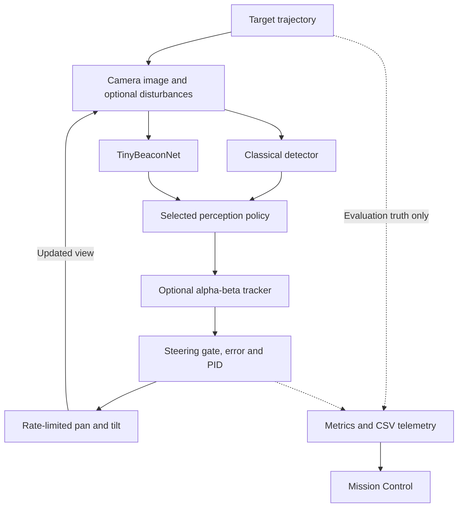

<!-- Default-branch scope checked against 0816888a6154debd039618edc5b699a83c7ea7ff. -->

<h1 align="center">FSOC</h1>

<p align="center">
  <strong>AI-assisted coarse alignment for mobile optical terminals</strong><br>
  A reproducible camera-to-control workbench for acquisition, tracking, and recovery.
</p>

<p align="center">
  <a href="https://github.com/ThatKJ/FSOC/actions/workflows/ci.yml"></a>
  
  
  
  
  <a href="LICENSE"></a>
</p>

<p align="center">
  <strong>Team IRODOV · Smart India Hackathon 2026 · SIH26169</strong>
</p>

<p align="center">
  <a href="#quick-start">Quick start</a> ·
  <a href="#demo">Demo</a> ·
  <a href="#measured-results">Results</a> ·
  <a href="#architecture">Architecture</a> ·
  <a href="docs/README.md">Documentation</a>
</p>

<p align="center">
  <a href="frontend/public/demo/fsoc-tracking-static.mp4">
    
  </a>
</p>

<p align="center">
  <em>Actual C++ Step-9 visualizer output during initial acquisition. Click to open the recorded simulation demo.</em>
</p>

FSOC closes the loop between **what a camera sees and how an optical terminal points**. It renders a moving beacon, locates it with classical or learned perception, checks temporal consistency, and commands a rate-limited virtual pan/tilt camera. Every correction changes the next observation.

The core runs in **C++20**. **TinyBeaconNet** performs neural inference through **OpenCV DNN**, while **Mission Control** makes the resulting trajectories, errors, controller commands, and tracking states inspectable.

**Current scope:** the deterministic software-in-the-loop simulation below is the frozen SIH baseline. This branch also carries the **phone/webcam camera-in-the-loop prototype** (`fsoc_live`, see [Mobile Phone Camera-in-the-Loop](#mobile-phone-camera-in-the-loop-optional-additive-prototype)): a real camera frame through the same perception/tracking/control stack, with an honestly virtual actuator. Its physical validation is tracked separately from the simulation results below.

## Why this exists

An optical communication beam must stay aligned with its receiver. When a terminal moves, a camera must acquire the remote beacon and maintain coarse pointing so a downstream fine-tracking stage can take over.

FSOC addresses **SIH26169**, the ISRO / Department of Space problem statement: *Development of an AI-Based Virtual Camera Tracking System for Coarse Alignment of Mobile Free Space Optical Communication Terminals*.

The workbench lets developers investigate a practical question: **when sensing becomes uncertain, which measurements should a controller trust?** Repeatable scenarios make it possible to compare perception and tracking changes before integrating an optical terminal.

## What you can do

| Capability | What it provides |
| --- | --- |
| **Run the complete feedback loop** | Image-derived centroid → pointing error → PID rate command → virtual camera motion → new image |
| **Compare perception modes** | Classical detection, standalone neural detection, and a conservative hybrid decision policy |
| **Track through short gaps** | An optional alpha-beta estimator with acquisition checks, bounded prediction, and loss/reacquisition states |
| **Challenge the detector** | Seeded noise, clutter, occlusion, and degraded-frame evaluation scenarios |
| **Inspect the experiment** | A nine-screen Mission Control UI with tracking overlays, spatial view, charts, events, and playback |
| **Keep the evidence** | A 42-column CSV schema, reproducible evaluation tools, model artifacts, and documented trade-offs |

## Quick start

### 1. Install prerequisites

You need a C++20 compiler, Ninja, OpenCV with `core`, `imgproc`, `imgcodecs`, and `dnn`, plus Node.js and npm for Mission Control. The frontend CI currently uses Node.js 20.

Use **CMake 3.25 or newer** for the checked-in presets: they use [preset schema version 6](https://cmake.org/cmake/help/latest/manual/cmake-presets.7.html#versions), even though the underlying project declares a 3.24 minimum.

<details>
<summary><strong>macOS setup</strong></summary>

Install Xcode Command Line Tools if they are missing:

```bash
xcode-select --install
```

With Homebrew available:

```bash
brew install cmake ninja opencv node
```

See [SETUP_MACOS.md](SETUP_MACOS.md) for the repository's setup guide.

</details>

<details>
<summary><strong>Ubuntu setup</strong></summary>

```bash
sudo apt-get update
sudo apt-get install -y build-essential cmake ninja-build libopencv-dev
cmake --version
```

Ensure the installed CMake supports schema version 6; older distribution packages may need updating. Install Node.js and npm separately. The [CI workflow](.github/workflows/ci.yml) records the exact automated build environment.

</details>

### 2. Clone and build the engine

```bash
git clone https://github.com/ThatKJ/FSOC.git
cd FSOC

cmake --preset debug -DFSOC_ENABLE_OPENCV=ON
cmake --build --preset debug
ctest --preset debug --output-on-failure
```

Explicitly enabling OpenCV makes missing image-processing dependencies a configuration error. The default `AUTO` setting can otherwise build only the math/control subset.

### 3. Run your first experiment

Run these commands from the **repository root** so the bundled model resolves correctly:

```bash
# Classical baseline
./build/debug/fsoc_demo static

# Hybrid perception with temporal tracking
./build/debug/fsoc_demo static --mode hybrid --tracker

# Save a complete run
mkdir -p generated/demo
./build/debug/fsoc_demo sinusoidal --mode hybrid --tracker --csv generated/demo/sinusoidal.csv
```

The ONNX model is already committed; training is not required to run the demo. Python is used by the optional offline training tools, not the C++ inference runtime.

### 4. Open Mission Control

```bash
cd frontend
npm ci
npm run dev
```

Open **[localhost:4317](http://localhost:4317)**. Select **ENGINE** to compute a new experiment with the local binary, or **REPLAY** to inspect a checked-in recording.

## Demo

The CLI includes five self-contained disturbance presets:

| Command | What to inspect |
| --- | --- |
| `./build/debug/fsoc_demo normal` | Classical baseline acquisition and correction |
| `./build/debug/fsoc_demo noise` | Response to ordinary image noise |
| `./build/debug/fsoc_demo clutter` | Conservative rejection and reduced tracking availability under bright distractors |
| `./build/debug/fsoc_demo occlusion` | Short prediction-assisted bridging across a detection gap |
| `./build/debug/fsoc_demo reacquisition` | Loss after a longer gap, followed by fresh acquisition |

These presets fix their own perception mode, tracker setting, and duration. Use the base scenarios—`static`, `sinusoidal`, `loss`, `open`, `closed`—when supplying `--mode`, `--tracker`, or `--duration` yourself. `--csv` remains available for preset runs.

<table>
  <tr>
    <td align="center" width="50%"><strong>Sinusoidal tracking</strong></td>
    <td align="center" width="50%"><strong>Loss and re-entry scenario</strong></td>
  </tr>
  <tr>
    <td></td>
    <td></td>
  </tr>
</table>

The images are native simulation visualizations. The browser UI is described below. For a narrated walkthrough, see the [Golden Demo guide](docs/MVP_GOLDEN_DEMO.md); recorded clips are in [demo assets](frontend/public/demo/).

## Mission Control

The frontend uses **Next.js, TypeScript, Tailwind CSS, Recharts, React Three Fiber, and Framer Motion**. A shared playback state keeps the experiment's displays on the same sample.

| Screen | Purpose |
| --- | --- |
| Overview and Mission Control | Experiment context, selected source, state, and primary telemetry |
| Optical Tracking | Centroid reticle, boresight, error vector, and pan/tilt readouts |
| Spatial View | Visualize target and camera geometry |
| Telemetry | Inspect time series and perception/tracker diagnostics |
| Scenarios, Benchmarks, and Validation | Review presets and documented baseline evidence |
| Architecture | Explore the system's module boundaries |

**How data reaches the UI:**

| Source | Actual behavior |
| --- | --- |
| **ENGINE** | The local Next.js server executes `fsoc_demo`, waits for the finite run to finish, reads its CSV, and returns the computed samples for interactive playback. |
| **REPLAY** | The server loads committed recordings from the C++ engine. These fixtures use classical perception with the tracker disabled. |
| **AUTO** | The server prefers the local engine and falls back to replay when necessary. Check the returned source before interpreting a run. |

ENGINE computes fresh results; the current default-branch transport is **run-then-playback**, rather than continuous frame streaming. Play, pause, and seek operate on the returned samples. The browser tracking viewport draws telemetry-driven overlays over a presentation background; it is not a raw camera-frame stream.

Inspect the implementation in [engine.ts](frontend/lib/simulation/engine.ts) and the [simulation API](frontend/app/api/simulation/%5Bscenario%5D/route.ts). The server needs access to the compiled native binary; a static website host alone cannot provide ENGINE mode.

## Architecture



**The controller receives measurements, never target-truth coordinates.** The simulator uses truth to construct images and evaluate results. Perception extracts the centroid from those images; the tracker and controller act on that measurement path.

The pure math/control modules remain separate from OpenCV. Angles are radians internally and converted at presentation boundaries. The baseline uses a fixed **20 ms** simulation step; measured processing throughput is a separate quantity.

### Perception and temporal tracking

**TinyBeaconNet** is a 27,282-parameter heatmap localizer trained on synthetic beacon images and exported to ONNX. It returns beacon presence and localization outputs; `AiBeaconDetector` runs it in C++ through OpenCV DNN. The [model card](models/MODEL_CARD.md) documents the Stage-2 training snapshot; [MVP metrics](docs/MVP_METRICS.md) cover the subsequent C++ integration and evaluation.

In **Hybrid** mode, [`resolve_perception()`](src/perception.cpp) uses an explicit policy:

| Available detections | Control-facing result |
| --- | --- |
| Classical and AI agree within 8 px | Accept the classical centroid |
| Classical only | Accept the classical centroid |
| AI only | Reject the unverified candidate |
| Classical and AI disagree | Reject both |
| Neither detector finds a candidate | Report no detection |

Standalone `--mode ai` is a separate diagnostic mode that does accept thresholded AI output. The rejection rules above apply to **Hybrid**.

The optional [`TargetTracker`](include/fsoc/target_tracker.hpp) adds an alpha-beta position/velocity estimate, temporally consistent acquisition, and a bounded coast period. It can decline a candidate or declare loss instead of continuing an unsupported track. It is enabled with `--tracker`; the classical baseline remains available with it disabled.

## Measured results

These are **recorded simulation results**, linked to their committed methods and evidence. They are not physical-camera accuracy measurements or a fresh benchmark of the reader's machine.

| | |
|---|---|
| Step-10 baseline acceptance | **7 / 7 PASS** |
| C++ test suites (`ctest`) | **22 / 22** (100%) |
| Frontend end-to-end tests (Playwright) | **20 / 20** |
| Severe (>50px) closed-loop outliers — Classical | 2,240 |
| Severe closed-loop outliers — Classical + Tracker | 12 (**↓ ~99.5%**) |
| Severe closed-loop outliers — Hybrid | 1,808 |
| Severe closed-loop outliers — Hybrid + Tracker (V2) | 9 (**↓ ~99.5%**) |
| Full-step latency, Hybrid + Tracker, P95 | **~1.2 ms**, vs. the 20 ms / 50 Hz budget |
| Telemetry pipeline | 42-column real CSV export, header-driven |

### Classical closed-loop baseline

The Step-10 comparison runs the same sinusoidal trajectory with and without control:

| Metric | Open loop | Closed loop |
| --- | ---: | ---: |
| RMS angular error | 6.4549° | **0.5461°** |
| Detection fraction | 57.4% | **100.0%** |
| Lost frames | 426 | **0** |

The baseline acceptance suite reports **7/7 passing scenarios**: static acquisition, slow linear tracking, sinusoidal tracking, near-FOV-edge acquisition, actuator saturation, target loss/re-entry, and open-versus-closed-loop comparison. [Method and results](docs/16_BASELINE_ACCEPTANCE.md) · [Consolidated metrics](docs/MVP_METRICS.md)

### What the temporal tracker changes

The Stage-4 ablation evaluates **11 scenarios × 5 seeds × 400 steps = 22,000 steps per configuration**:

| Configuration | Severe pointing outliers >50 px | Accepted-detection coverage |
| --- | ---: | ---: |
| Classical | 2,240 | 99.69% |
| Classical + tracker | **12** | 77.51% |
| Hybrid | 1,808 | 97.35% |
| Hybrid + tracker | **9** | 77.05% |

**Hybrid + tracker reduces severe outlier counts by approximately 99.5% versus Hybrid, while coverage falls by 20.3 percentage points.** The benefit comes from rejecting unreliable measurements. It is not a 99.5% accuracy claim. Reported RMS in this ablation uses accepted-detection frames, so reduced coverage affects its interpretation. [Full ablation and counterexamples](docs/MVP_ABLATION.md)

### Timing and model size

| Measurement | Recorded result |
| --- | --- |
| TinyBeaconNet parameters | 27,282 |
| ONNX Runtime ↔ C++ decoded-centroid difference | 1.54 × 10⁻⁷ px on the recorded parity fixture |
| Hybrid + tracker full-step P95 | **1.21 ms** in the uncontended MVP freeze run |
| Fixed simulation interval | 20 ms / 50 Hz |
| CSV telemetry | 42 columns: 27 core + 7 perception + 8 tracker |

Timing was measured on the documented **Apple M5 development machine**, not embedded or flight hardware. Earlier runs report P95 values of 1.439–1.639 ms under their recorded conditions; timing depends on workload and platform. [Freeze run](docs/SIH_MVP_FREEZE.md) · [Timing methodology](docs/MVP_METRICS.md)

## Mobile Phone Camera-in-the-Loop (optional, additive prototype)

Alongside the fully-simulated demo above, `fsoc_live` (`apps/fsoc_live.cpp`) makes the
**sensing side** real: a real phone/webcam frame, run through the exact same Classical +
TinyBeaconNet + Safe Hybrid perception, P0-v2 state estimator, and PID controller the
simulation uses — see `docs/PHONE_CAMERA_METRICS.md`. The **actuator side stays honestly
virtual**: `VirtualPanTiltActuator` bookkeeps a commanded angle and drives no physical
hardware. Every telemetry frame and the Mission Control view at `/mission/live` label this
explicitly (`CAMERA SOURCE: REAL_PHONE_CAMERA`, `ACTUATOR: VIRTUAL`). This is a
"real-camera-in-the-loop prototype," never a "physical pan/tilt tracking system" — see
`docs/PHONE_CAMERA_METRICS.md`'s claim boundary. Run it yourself with `./run_fsoc.sh phone`
(or `./run_fsoc.sh golden` for the full narrated walkthrough,
`docs/PHONE_CAMERA_GOLDEN_DEMO.md`) — requires a real camera and, on macOS, granting an OS
permission prompt.

## Hardware boundary

No physical beacon, servo, or pan/tilt actuator has been used anywhere in this project, and
the frozen SIH MVP simulation above uses zero physical hardware of any kind. The one
exception is the optional prototype directly above: it reads frames from a real camera, but
still commands no physical actuator. Every measured number in the "Measured results" section
above comes from the deterministic C++ simulation on a desktop-class development machine
(Apple M5), not from the camera prototype. **No claim of embedded, flight, physical
actuation, or real-time-on-target hardware performance is made or implied anywhere in this
repository.** See `docs/MVP_METRICS.md §5`, `docs/SIH_MVP_FREEZE.md §6`, and
`docs/PHONE_CAMERA_METRICS.md`.

## Working modes

FSOC runs in more than one context, and each has a different, explicit camera/actuator
boundary — never blurred, never silently upgraded to sound more impressive:

| Mode | Camera | Actuator | Purpose |
|---|---|---|---|
| **Simulation** (`fsoc_demo`) | Synthetic (rendered) | Simulated | Deterministic development, evaluation, and the frozen SIH baseline. |
| **Mission Control — REPLAY** | Synthetic (recorded) | Simulated | Public/offline viewing of a checked-in run — no C++ build required. |
| **Mission Control — ENGINE** | Synthetic (live) | Simulated | Local viewing of `fsoc_demo` running live, streamed over `/api/simulation/:scenario`. |
| **Phone camera-in-the-loop** (`fsoc_live`) | Real (phone/webcam) | Virtual (bookkept, drives nothing) | Proves the perception → estimation → control stack against a real image, locally. |
| **Physical hardware** | Real | Real (physical pan/tilt) | **Not implemented.** Would replace `FrameSource` / `PanTiltCamera` behind the same interfaces (`docs/09_FUTURE_ARCHITECTURE.md`) — no such hardware exists in this repository today. |

The public web deployment (see **Deployment** below) only ever serves the first two rows —
it has no access to your camera or a local C++ process, and it never pretends otherwise.

## Deployment

The public site is a static/serverless Next.js deployment of `frontend/` — it shows the
project, its architecture, and deterministic replay evidence produced by the real C++
engine. It is **not** a backend for the phone-camera prototype: your camera and `fsoc_live`
run on your own machine, and Vercel has no way to reach either. `/mission/live` detects the
missing local session and shows a "run this locally" state instead of fabricating one —
see the API route at `frontend/app/api/live-camera/route.ts`.

Full architecture, project settings, and the local-vs-public split: **`docs/DEPLOYMENT.md`**.

### One-command launcher

```bash
./run_fsoc.sh
```

One command, one interactive menu — Simulation Demo, Phone Camera Demo, Camera Probe,
Mission Control Only, Run Full Validation, Golden Phone Demo, or Build Everything. It
builds only what's missing, never guesses a port (reads it from
`frontend/package.json`), never touches a process it didn't start, and cleans up on
Ctrl+C. Non-interactive: `./run_fsoc.sh simulation|phone|probe|ui|test|golden|build`.
See `scripts/run_fsoc.sh --help` for every flag (`--rebuild`, `--no-browser`).

## Validation

Run the baseline checks from the repository root:

```bash
cmake --preset debug -DFSOC_ENABLE_OPENCV=ON
cmake --build --preset debug
ctest --preset debug --output-on-failure                                   # 22/22 C++ suites
./build/debug/step10_validation_smoke                                      # 7/7 baseline gates
cmake --preset release && cmake --build --preset release
./build/release/stage4_evaluation --out generated/ai_stage4                 # ~10-15 min, frozen protocol
./build/release/stage4_tracker_ablation --out generated/ai_stage4_ablation  # ~15 min, clutter mitigation
./build/release/mvp_dynamic_scenarios --out generated/mvp_dynamic_scenarios # velocity/dropout/moving-clutter
./build/release/mvp_latency_budget                                          # full latency budget, seconds
cd frontend && npm run typecheck && npm run lint && npm run build && npx playwright test
```

For the frontend, run the following inside `frontend/` after `npm ci`. The checked-in Playwright configuration uses **installed Google Chrome**, rather than a Playwright-managed Chromium download.

```bash
npm run typecheck
npm run lint
npm run build
npx playwright test
```

## Known limitations

State these proactively — they're disclosed in `docs/SIH_MVP_FREEZE.md`, not buried:

1. **A temporally coherent moving distractor defeats the clutter mitigation
   completely** — identical outlier counts with or without the tracker
   (`docs/MVP_ABLATION.md §6`). The single most important limitation.
2. **The intrinsic single-frame classical false-positive rate (44.9%) is unchanged** —
   unfixable without touching the frozen classical detector algorithm.
3. **AI-only reacquisition through `resolve_perception()` is not implemented** — the
   prerequisite gate exists (ADR-019); unlocking it is a distinct, deliberately
   deferred change to the frozen fusion policy.
4. AI recall is intentionally low (~16-40% depending on scenario) rather than
   over-confident — a deliberate precision-over-recall design choice, not a bug.
5. Real coverage cost: Hybrid+Tracker trades ~20 points of coverage for the outlier
   reduction above — a disclosed trade, not a free win.
6. Evaluated at n=5 seeds per scenario (matches the frozen protocol) — real, not
   large-sample, statistics.

## Repository structure

```text
include/fsoc/       Public interfaces
src/                Core implementations
apps/               Executable simulation/demo/benchmark/evaluation programs
tests/              Mathematical/unit validation (CTest)
models/             Committed trained ONNX model + metadata (models/MODEL_CARD.md)
tools/ai/           Offline Python training toolchain (NOT part of the C++ runtime)
tools/beacon_display.html  Real, physical test-target page for the phone-camera prototype
frontend/           Next.js Mission Control UI (reads real fsoc_demo telemetry)
cmake/              Build policies
.github/workflows/  CI (build + test, C++ and frontend)
.claude/skills/     Claude Code engineering skills
.claude/agents/     Specialist subagents
docs/               Design docs, measured metrics, ADRs, development history
prompts/            Reusable Vibe Coding prompts
generated/          Git-ignored run artifacts (CSV/PNG/JSON reports) — never committed
```

The [CI workflow](.github/workflows/ci.yml) separately builds/tests C++ and checks the frontend. Its browser job uses replay fixtures; local tests that require an engine need the native build available. The badge at the top links to current runs; [freeze-time test results](docs/SIH_MVP_FREEZE.md) are historical evidence.

<details>
<summary><strong>Reproduce AI evaluation, tracker ablation, and latency measurements</strong></summary>

From the repository root:

```bash
cmake --preset release -DFSOC_ENABLE_OPENCV=ON
cmake --build --preset release

./build/release/ai_inference_benchmark
./build/release/stage4_evaluation --out generated/ai_stage4
./build/release/stage4_tracker_ablation --out generated/ai_stage4_ablation
./build/release/mvp_dynamic_scenarios --out generated/mvp_dynamic_scenarios
./build/release/mvp_latency_budget
```

The full evaluation and ablation are longer-running experiments. Measure latency separately from CPU-heavy evaluations so the load condition is clear. The frozen [Stage-4 protocol](docs/21_AI_STAGE4_EVALUATION_PROTOCOL.md) defines scenarios, seeds, and metrics.

</details>

## Limits and next steps

The evaluation deliberately includes failure cases:

- **Coherent moving distractors remain a weakness.** A smoothly moving distractor defeats the temporal gate in the documented counterexample.
- **Coverage is traded for reliability.** The outlier reduction does not eliminate the classical detector's 44.93% common-frame false-positive rate in the degraded evaluation.
- **AI recall is limited.** The recorded synthetic tests report roughly 16–40% recall depending on the evaluation; real-camera generalization requires separate evidence.
- **Physics and hardware remain bounded in scope.** Image degradations do not establish validated atmospheric propagation. Fine optical PAT, physical gimbal tracking, and an optical data link are outside the default branch's measured capability.

| Stage | Status |
| --- | --- |
| Deterministic C++ coarse-alignment loop | Implemented; baseline acceptance documented |
| Neural inference and Hybrid policy | Implemented; model, parity checks, and evaluation committed |
| Temporal tracking and bounded recovery | Implemented; ablation and failure cases documented |
| Phone/webcam frame input with virtual actuation | Implemented (`fsoc_live`); see [Mobile Phone Camera-in-the-Loop](#mobile-phone-camera-in-the-loop-optional-additive-prototype) and [test documentation](docs/PHONE_CAMERA_METRICS.md) |
| Continuous streaming, stronger live-session UX, and evidence export | Further integration work |
| Packaged desktop application and physical pan/tilt bench | Planned |
| Coarse-to-fine handoff and optical-link validation | Future research |

## Documentation

| Start here | Read it for |
| --- | --- |
| [Documentation index](docs/README.md) | A map of the complete project |
| [Golden Demo](docs/MVP_GOLDEN_DEMO.md) | Commands, narration, and expected behaviors |
| [MVP metrics](docs/MVP_METRICS.md) | Experiment conditions and measured results |
| [Tracker ablation](docs/MVP_ABLATION.md) | The clutter investigation, trade-offs, and counterexamples |
| [MVP freeze](docs/SIH_MVP_FREEZE.md) | The reproducible presentation baseline |
| [Coordinates and math](docs/04_COORDINATES_AND_MATH.md) | Geometry, signs, and units |
| [Interface contracts](docs/15_INTERFACE_CONTRACTS.md) | Boundaries between modules |
| [Telemetry schema](docs/08_TELEMETRY_SCHEMA.md) | The CSV fields and their meanings |
| [AI architecture](docs/19_AI_PERCEPTION_ARCHITECTURE.md) | Learned perception and hybrid integration |
| [Model card](models/MODEL_CARD.md) | Training data, checkpoint, and model limitations |
| [Architecture decisions](DECISIONS.md) | Why the system is built this way |
| [Development history](docs/DEVELOPMENT_HISTORY.md) | The engineering progression from the initial baseline |

<details>
<summary><strong>Repository map</strong></summary>

| Path | Contents |
| --- | --- |
| `include/fsoc/` | Public C++ interfaces and data contracts |
| `src/` | Geometry, simulation, perception, tracking, control, and telemetry |
| `apps/` | Demo, validation, dataset, and benchmark executables |
| `tests/` | C++ tests and parity fixtures |
| `models/` | Trained ONNX model, metadata, and evaluation records |
| `tools/ai/` | Optional offline Python training/export tools |
| `frontend/` | Mission Control, data adapters, and browser tests |
| `docs/` | Design, metrics, protocols, and engineering history |
| `.github/workflows/` | CI definitions |
| `generated/` | Local run artifacts; created at runtime and git-ignored |

</details>

## Troubleshooting

| Symptom | Check |
| --- | --- |
| `fsoc_demo` is missing after a build | Reconfigure with `-DFSOC_ENABLE_OPENCV=ON`, resolve missing OpenCV components, then rebuild. |
| CMake rejects the presets | Use CMake 3.25+ for schema version 6. |
| ENGINE is unavailable | Build the native executable and start Next.js from `frontend/`. A server-side `FSOC_DEMO_BIN` can override its path. |
| AI/Hybrid falls back to Classical | Run from the repo root and check that `models/tiny_beacon_net.onnx` loads. Inspect the warning and active-mode banner; fallback is not evidence of an AI run. |
| Perception settings do not change a replay | The committed fixtures are classical/tracker-off. Use ENGINE to compute a different configuration. |
| Playwright cannot find Chrome | Install Google Chrome to match `frontend/playwright.config.ts`. |

## Contributing

Open an [issue](https://github.com/ThatKJ/FSOC/issues) with the scenario, configuration, commit, and evidence needed to reproduce a problem. Keep changes focused and include relevant tests. See [CONTRIBUTING.md](CONTRIBUTING.md) and [SECURITY.md](SECURITY.md) for the full process and reporting a vulnerability.

Read [AGENTS.md](AGENTS.md) and [CLAUDE.md](CLAUDE.md) before implementation (human or AI). They define the module boundaries (`Environment` / `Trajectory` / `PanTiltCamera` / `Detector` / `Controller` / ...), coordinate conventions, and the C++20/CMake-only build rules that keep the simulation mathematically traceable. Preserve the frozen baseline, keep truth out of the controller, retain explicit units, and document any algorithm change with its measured effect (`docs/16_AI_CODING_GUARDRAILS.md`).

## License

[MIT](LICENSE).

<p align="center">
  <strong>Built by Team IRODOV</strong><br>
  Student project for SIH26169 · Space Technology
</p>
